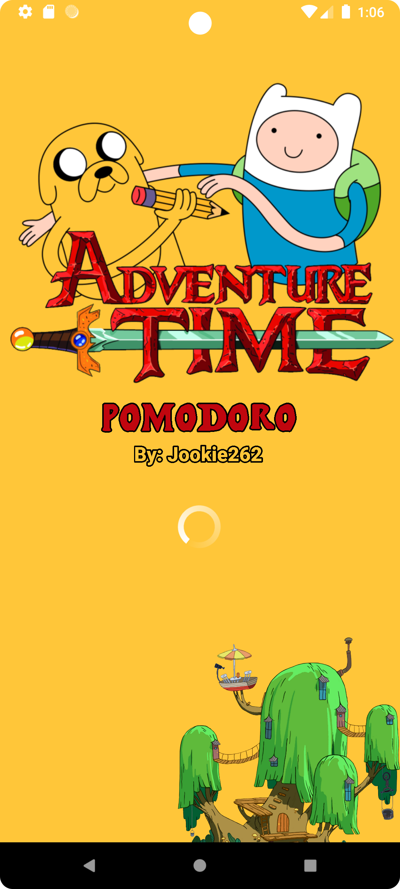
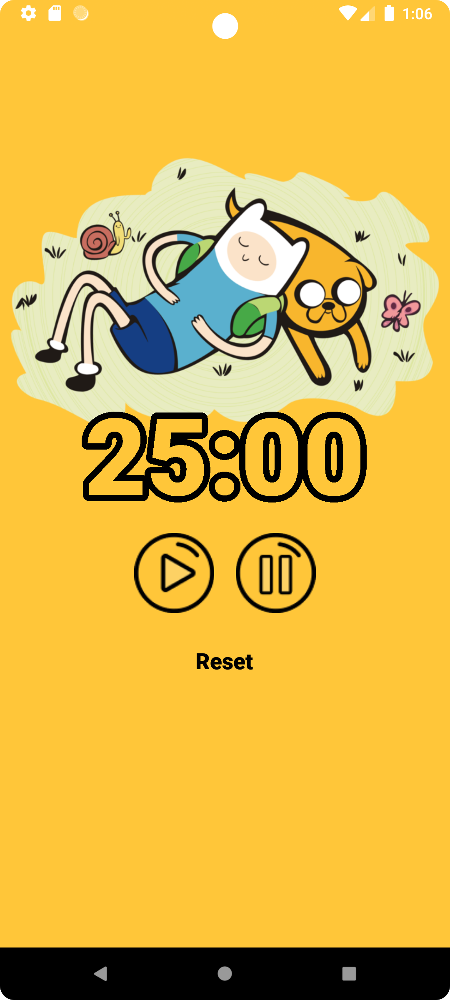

# Simple Pomodoro App
A Task Performance in Second Semester Prelim in Mobile Systems and Technologies. I designed a basic pomodoro application with a 25-minute timer and an Adventure Time theme. 

## Screen Shot

    
    

## Contribution 🔥
If you wish to help improve this project, fork this repo and submit your own pull request. If you discover a problem with this project, please report it to the issue page. Thank you very much 😊.

## Thank you 💖
If you like this project just click ⭐ and share it with others.
